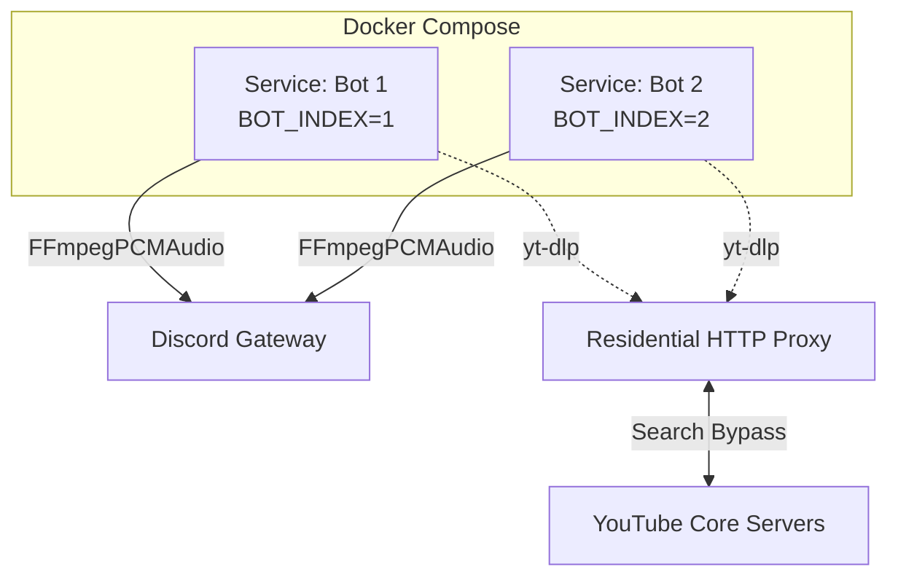

<div align="center">
  
</div>

<div align="center">
  <p><strong>A horizontally-scaled, natively proxied Discord Music Bot architecture powered purely by Python and yt-dlp.</strong></p>
  
  [](https://www.python.org/)
  [](https://github.com/Rapptz/discord.py)
  [](https://github.com/yt-dlp/yt-dlp)
  [](https://www.docker.com/)
  [](LICENSE)
</div>

## 🌟 Overview

**Multi-Music Discord Bots** is an advanced deployment template customized for hosting **multiple completely independent Discord Music Bots** directly utilizing `yt-dlp` and `FFmpegPCMAudio` without requiring bloated JVMs, Lavalink nodes, or Node.js bridges.

By pairing `discord.py` securely with HTTP Residential Proxies and native Docker Compose orchestration, this architecture perfectly bypasses YouTube datacenter blocking, avoids bot-connection overlaps, and securely protects itself against Google's constant scraper mitigation techniques.

## ✨ Key Features

- **🚀 Horizontal Native Scaling:** Run an infinite amount of independent bots seamlessly through Docker Compose without complicated Python sub-processing multiplexers. Every bot binds smoothly via `BOT_INDEX`.
- **📻 Pure Native Python Audio:** All audio streaming is piped natively through `discord.FFmpegPCMAudio` natively—zero audio loss and zero JVM memory bloat.
- **🛡️ Proxied `yt-dlp` Bypass:** Deep native proxy integration routes all metadata scraping natively. No more `429 Too Many Requests` or cloud datacenter blocks on YouTube headers since traffic appears heavily residential.
- **🔞 Age-Restriction Bypass via Cookies:** Employs an internal `cookies.txt` bypass configuration natively injected into yt-dlp avoiding PoW problems.
- **⚡ Prefix-less Native Audio Setup:** You can completely avoid slash commands—have users just type `a play song_name` (or whatever configured `BOT_PLAY_LETTER` applies) and instantly enjoy audio. 
- **🌐 Stale Session Pruning:** Specifically hard-coded thread-safe websocket cleanup natively prevents the dreaded Discord Voice `4006` gateway corruption error natively.

---

## 🛠️ Requirements
- **Docker & Docker Compose** (Mandatory for handling dependencies like `FFmpeg` out-of-the-box).
- **Discord Bot Tokens** with *Message Content* and *Voice State* Intents enabled on the [Discord Developer Portal](https://discord.com/developers/applications).
- Supported HTTP Residential Proxy (e.g. DataImpulse).
- Optional: `cookies.txt` (Drop this in your project root to seamlessly bypass YouTube age restriction pop-ups natively).

---

## 🚀 Installation & Deployment

### 1. Clone the repository
```bash
git clone https://github.com/S1nju/multi-music-discord-bots.git
cd multi-music-discord-bots
```

### 2. Configure Environment Variables
Create a `.env` file in the root directory and define your API variables securely:

```env
# Proxy Injection Strategy
PROXY_HOST=gw.dataimpulse.com
PROXY_PORT=823
PROXY_USER=proxy_username
PROXY_PASSWORD=proxy_password

# --- BOT CONFIGURATIONS ---
# Bot 1
BOT_TOKEN1=YOUR_SECRET_TOKEN
BOT_CHANNEL_ID1=YOUR_VOICE_CHANNEL_ID
BOT_PLAY_LETTER1=a
BOT_PREFIX1=-

# Add BOT_TOKEN2, BOT_CHANNEL_ID2, etc. natively underneath if orchestrating multiple.
```

### 3. Deploy Horizontally with Docker Compose
To add bots to your multiplex, duplicate the native docker service slice in your `docker-compose.yml` natively passing the exact `BOT_INDEX` referencing your `.env`:

```yaml
services:
  bot1:
    build: .
    container_name: musicbots_1
    restart: always
    env_file: .env
    environment:
      - BOT_INDEX=1

  bot2:
    build: .
    container_name: musicbots_2
    restart: always
    env_file: .env
    environment:
      - BOT_INDEX=2
```

Build and launch natively:
```bash
docker compose up --build -d
```
> **You're done!** To view your active bots natively, type `docker compose logs -f bot1`.

---

## 🎮 Bot Commands
All commands execute securely relying purely on your dynamically assigned `BOT_PLAY_LETTER` inside `.env`. (If your letter is `a` ...)

| Command | Description |
|---|---|
| `a play <query/url>` | Play a song directly from HTTP proxy parsing (or just type `a <song>`!). |
| `a stop` or `a leave` | Gracefully forces the bot to disconnect natively and clears websocket status. |
| `a pause` or `a s` | Temporarily halts music playback natively via VoiceClient. |
| `a resume` | Resumes a historically paused track effortlessly. |
| `status`, `help` | (Using `BOT_PREFIX`) Detailed system bot index and diagnostics. |

---

## 💡 Architecture Explained
### `yt-dlp` Routing Native Engine
Unlike bulky Lavalink setups scaling through shared sockets, every `musicbot` spawns a strictly isolated `asyncio.Lock()` execution loop securely feeding the search query (`yt-dlp`) down your Proxy Pipeline seamlessly extracting the raw AV stream.



## 📜 License
This project is licensed under the MIT License - see the [LICENSE](LICENSE) file for details.
